# RepositoryScanner
Account analyzer based on logical lines of code (public &amp; private repo), exports svg card

A GitHub profile card showing the top programming languages you use, styled with the **Kanagawa-paper-ink** theme.  
The data comes from the GitHub API and updates automatically every 24 hours via GitHub Actions.



---

## Features
- **Live data** from your public and private repositories.
- **Top 6 languages** by total lines of code.
- **Kanagawa-paper-ink** color palette.
- **Bar chart layout** with optional animation.
- Auto-updates every 24h UTC.

---

## Local Usage

### 1. Clone the repo
```bash
git clone https://github.com/mavantgarderc/RepositoryScanner.git
cd RepositoryScanner
````

### 2. Create a GitHub Personal Access Token

* Go to **Settings → Developer settings → Personal access tokens (classic)**.
* Click **Generate new token (classic)**.
* Check:

  * `repo` (for private repos)
  * `read:user`
* Copy the token.

### 3. Set the token in your shell

```bash
export GH_TOKEN='your_token_here'
```

### 4. Install dependencies

```bash
pip install requests
```

### 5. Run the generator

```bash
python3 scripts/fetch_languages.py
```

* The script will create/update:

```
assets/languages.svg
```

### 6. Preview

Open `assets/languages.svg` in your browser.

---

## GitHub Actions Auto-Update

### 1. Add your token to repo secrets

* Go to **Repo → Settings → Secrets → Actions**.
* Add:

  * Name: `GH_TOKEN`
  * Value: your token

### 2. Workflow file

The `.github/workflows/update-languages.yml` is already set up to:

* Run every 24h UTC (`cron: "0 0 * * *"`).
* Commit the updated `assets/languages.svg`.

### 3. First run

* Push the repo to GitHub.
* In the **Actions** tab, run the workflow manually once to generate the first card.

---

## Add to Your Profile README

In your GitHub profile repo (`<username>/<username>`):

```markdown

```

---

## Notes

* The script uses `/user/repos` endpoint for private+public repo access.
* If you change your GitHub username, update `USERNAME` in `scripts/fetch_languages.py`.
* Forked repos are ignored by default; you can modify the filter in `get_repos()`.

---
# RepositoryScanner

A sleek GitHub profile card that analyzes your coding languages across all repositories (public & private) and generates a beautiful SVG visualization with the Kanagawa-paper-ink theme.


## ✨ Features

- 🔍 **Comprehensive Analysis**: Scans both public and private repositories
- 📈 **Top 6 Languages**: Shows your most-used programming languages by lines of code
- 🎨 **Kanagawa Theme**: Beautiful color palette inspired by the Kanagawa-paper-ink theme
- ⚡ **Auto-Updates**: Refreshes every 24 hours via GitHub Actions
- 🚀 **Zero Maintenance**: Set it up once, forget about it
- 📱 **SVG Output**: Crisp graphics that look great anywhere

## 🚀 Quick Start

### 1. Fork This Repository

Click the "Fork" button at the top right of this page to create your own copy.

### 2. Create a GitHub Personal Access Token

1. Go to [GitHub Settings → Developer settings → Personal access tokens (classic)](https://github.com/settings/tokens)
2. Click **"Generate new token (classic)"**
3. Give it a descriptive name (e.g., "RepositoryScanner Token")
4. Select the following scopes:
   - ✅ `repo` (Full control of private repositories) - *Required for private repos*
   - ✅ `read:user` (Read user profile data)
5. Click **"Generate token"**
6. **Copy the token immediately** (you won't be able to see it again!)

### 3. Add Repository Secrets

1. In your forked repository, go to **Settings → Secrets and variables → Actions**
2. Click **"New repository secret"**
3. Add the following secrets:

   **Secret 1:**
   - Name: `GH_TOKEN`
   - Value: `your_github_token_here`

   **Secret 2:**
   - Name: `EXCLUDED_LANGS` 
   - Value: `HTML,CSS,Dockerfile` *(optional - languages to exclude from the chart)*

   **Secret 3:**
   - Name: `USERNAME`
   - Value: `your_github_username`

### 4. Run the Workflow

1. Go to the **Actions** tab in your repository
2. Click on **"Update Language Stats"** workflow
3. Click **"Run workflow"** and select the main branch
4. Wait for it to complete (usually takes 30-60 seconds)

### 5. Use in Your Profile

Add this to your GitHub profile README (`username/username` repository):

```markdown
## My Coding Languages


```

Replace `username` with your actual GitHub username.

## Local Development

Want to test locally before setting up automation?

```bash
# Clone your fork
git clone https://github.com/your-username/RepositoryScanner.git
cd RepositoryScanner

# Install dependencies
pip install requests python-dotenv

# Create .env file (for local testing only)
export GH_TOKEN='your_token_here'
export USERNAME='your_github_username'
export EXCLUDED_LANGS='HTML,CSS,Dockerfile'

# Run the script
python3 scripts/fetch_languages.py

# Check the output
open assets/languages.svg
```

## Configuration

### Environment Variables

| Variable | Required | Description | Example |
|----------|----------|-------------|---------|
| `GH_TOKEN` | ✅ | GitHub Personal Access Token | `ghp_xxxxxxxxxxxx` |
| `USERNAME` | ✅ | Your GitHub username | `mavantgarderc` |
| `EXCLUDED_LANGS` | ❌ | Comma-separated languages to exclude | `HTML,CSS,Dockerfile` |

### Workflow Schedule

The workflow runs automatically every day at midnight UTC. You can modify the schedule in `.github/workflows/update-languages.yml`:

```yaml
schedule:
  - cron: "0 0 * * *"  # Daily at midnight UTC
```

Common cron examples:
- `"0 */12 * * *"` - Every 12 hours
- `"0 0 * * 1"` - Every Monday at midnight
- `"0 0 1 * *"` - First day of every month

## Customization

### Colors

The card uses the Kanagawa-paper-ink theme. To customize colors, edit the `COLORS` dictionary in `scripts/fetch_languages.py`:

```python
COLORS = {
    'Python': '#7E9CD8',
    'JavaScript': '#E6C384',
    'TypeScript': '#98BB6C',
    # Add more languages...
}
```

### Layout

You can adjust the card dimensions and styling by modifying the SVG generation code in `generate_language_svg()`.

## 🔒 Security & Privacy

### What Access Does This Tool Need?

- **Repository Access**: Reads your repository list and language statistics
- **No Code Access**: Never reads your actual code, only metadata
- **Private Repos**: Only accesses if you grant `repo` scope (required for private repository language stats)

### Security Best Practices

**We Do:**
- Use GitHub Secrets for token storage
- Follow GitHub's API best practices
- Exclude forked repositories by default
- Provide clear documentation on token scopes

**We Never:**
- Store your token in code or logs
- Access your code content
- Share your data with third parties
- Require unnecessary permissions

### For Public Repositories Only

If you only want to analyze public repositories, create your token with just the `public_repo` scope instead of `repo`.

## Troubleshooting

### Common Issues

**401 Unauthorized Error**
```
Error fetching languages for repo: 401 Client Error: Unauthorized
```
**Solution**: Check that you've added the `GH_TOKEN` secret correctly and that your token has the right scopes.

**Empty Language Data**
```
No language data found!
```
**Possible Causes**:
- All your repositories are forks (excluded by default)
- All your repositories use excluded languages
- Your token doesn't have access to any repositories

**Workflow Not Running**
- Check that GitHub Actions are enabled in your repository settings
- Ensure the workflow file is in `.github/workflows/` directory
- Verify the YAML syntax is correct

## 📊 How It Works

1. **Repository Discovery**: Uses GitHub API to list all your repositories
2. **Language Analysis**: Fetches language statistics from each repository
3. **Data Processing**: Aggregates and sorts languages by total bytes of code
4. **Visualization**: Generates an SVG chart with percentages and bars
5. **Automation**: GitHub Actions runs this process daily and commits updates

## Contributing

Contributions are welcome! Here are some ways you can help:

- Report bugs or suggest features
- Improve the visual design
- Enhance documentation
- Add new customization options
- Improve security practices

## License

This project is open source and available under the [MIT License](LICENSE).

## Acknowledgments

- Inspired by [github-readme-stats](https://github.com/anuraghazra/github-readme-stats)
- Kanagawa color theme by [rebelot/kanagawa.nvim](https://github.com/rebelot/kanagawa.nvim)

